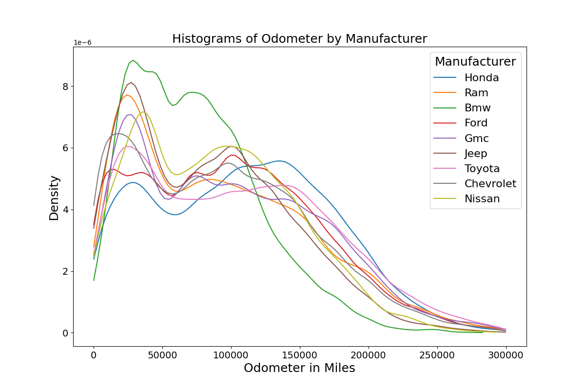
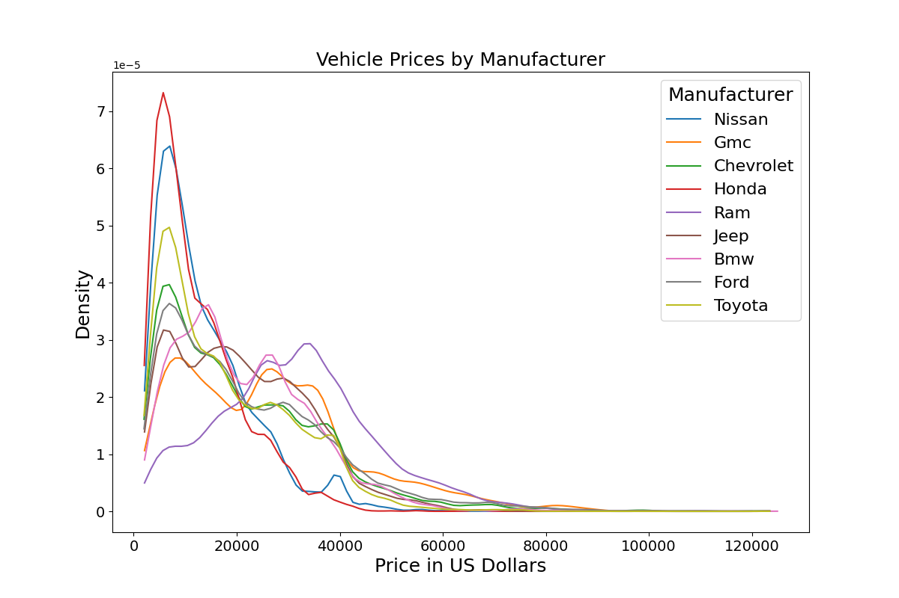
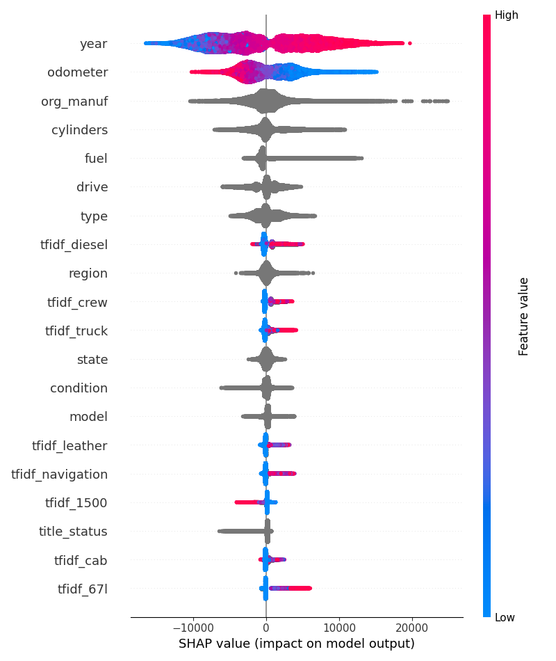

## Marketing Tracking of Craiglist's Used Cars

## Executive summary
To predict Craigslist ad car prices, I developed a light GBM model. We were able to get an accuracy of $5,400 and explain 85% of the variability in Prices with our model. The most important variables were Year, Odometer, Manufacturer and words associated with high trim levels like Leather and Navigation. Another very important variable was if the machine was a truck. Future improvments to the model could invovlve better understanding Carvana ads and utizling car images to detect rust.  

## Table of Contents
1. [Introduction](#introduction)
2. [Problem Definition](#problem-definition)
4. [Exploratory Data Analysis (EDA)](#exploratory-data-analysis-eda)
5. [Data Preprocessing](#data-preprocessing)
    - 5.1 [Handling Missing Values](#missing-values)
    - 5.2 [Filtering Data](#data-filtering)
    - 5.3 [Feature Engineering](#feature-eng)
6. [Modeling](#modeling)
    - 6.1 [Simple Linear Regress](#model-1)
    - 6.2 [Log(Price) Multiple Linear Regression](#model-2)
    - 6.3 [Basic LightGBM](#model-3)
    - 6.4 [LightGBM with words and hyperparmater tuning](#model-4)
8. [Model Comparasions and Usage Example](#model-evaluation)
9. [Conclusion and](#conclusion)
10. [Future Work](#future-work)
    - 10.1 [Renovate Carvana Ads](#reno-carv)
    - 10.2 [Build CVML damage spotter](#cvml)
    - 10.3 [CV for model training](#cv)
    - 10.4 [Add Unit Testing](#unit-testing)
    - 10.5 [Zip Code Data](#zipcode)
11. [References](#references)

## Introduction
**Growing up, I had a family friend who was always poring over Craigslist ads, buying cars, fixing them up, and flipping them for profit. I can still picture him, bathed in the dim glow of a cathode ray tube, surrounded by stacks of booklets. Each flip took him at least forty hours of searching. The young nerd in me quickly identified that as the biggest bottle neck.**

This project is an ode to that family friend. It aims to build a tool to predict Craigslist car prices—similar to the tools used by Kelley Blue Book and captive financial companies like Ford Financing. Our anonymous hero could use this tool to efficiently find underpriced offers and snatch them up before others do.

Taking it a step further, our hero could even create a synthetic dataset of a thousand representative vehicles, train the model month by month, and observe how the prices of your synthetic vehicles change over time. Knowing the test data was fixed, any changes in price are attributable to changes in the trained model. This could be used as an index providing valuable insights into market trends and movements. Another use case, is perhaps they could use a model interptation library to dig into exactly why the model predicts what it is predicting. I show case this idea in the conclusion.

## Problem Definition

A generous contributor has scraped 463,000 car postings from Craigslist and shared them on [Kaggle](https://www.kaggle.com/datasets/austinreese/craigslist-carstrucks-data/code). I have downloaded the [zipped CSV file](inputs\vehicles.csv.zip), and this is where our analysis begins. This file is too big to easily fit on GitHub, so if you'd like to run these scripts yourself, you'll need to download it and save it to inputs\vehicles.csv.zip. 

The target variable is the price, represented in US Dollars. The dataset includes eighteen useful covariates which I lay out in the data dictionary below. Our most important variables will be manufacturer, year, odometer and description.

#### Table 1: Data Dictionary
| Column Name     | Data Type | Description                                                      | % Missing | % Zero | % Distinct |
|-----------------|-----------|------------------------------------------------------------------|-----------|------------|----------|
| price           | Float     | Target variable representing the price in US Dollars             | 0%        | 0%        | .1%        |
| region          | String    | The region or metro area where the vehicle is located            | 0%        | 7.7%         | 3.7%        |
| year            | Integer   | Year of manufacture of the vehicle                               | 0.3%        | 0%        | 0%        |
| manufacturer    | String    | The manufacturer (e.g., Ram, Jeep)                               | 4.1%        | NA        | 0%        |
| model           | String    | The vehicle's model (e.g., Silverado, Forester)                  | 1.2%        | NA        | 7%        |
| condition       | String    | Condition of the vehicle (e.g., good, fair)                      | 40.8%       | NA         | 0%        |
| cylinders       | String   | Number of cylinders (e.g., 4 cylinders, 6 cylinders)              | 41.6%        | NA        | 0%        |
| fuel            | String    | Type of fuel used (e.g., diesel, gas)                            | .7%        | NA         | 0%        |
| odometer        | Float     | Miles the vehicle has traveled                                   | 1%        | 95%        | 24.6%        |
| title_status    | String    | Status of the vehicle's title (e.g., rebuilt, clean)             | 1.9%        | NA         | 0%        |
| transmission    | String    | Type of transmission (e.g., automatic, manual)                   | 0.6%        | NA         | 0%        |
| drive           | String    | Drive type (e.g., FWD, RWD)                                      | 30.6%       | NA         | 0%        |
| type            | String    | Type of vehicle (e.g., sedan, truck)                             | 21.8%        | NA         | 0%        |
| paint_color     | String    | Exterior paint color (e.g., white, black)                        | 30.5%     |   NA         | 0%        |
| description     | String    | A desciption of the vehicle by the seller                        | 0.1%        | NA         | 84.5%        |
| state           | String    | U.S. state where the vehicle is being sold                       | 0%        | 0%         | 0%        |
| lat             | Float     | Latitude of the vehicle’s location                               | 1.5%       | 0%       | 12.5%        |
| long            | Float     | Longitude of the vehicle’s location                              | 1.5%       | 0%       | 12.6%        |

## Exploratory Data Analysis (EDA)

For a thorough EDA using `y_data_profiling`, see the visualizations on a subsample of the data from [before proccessing](results/data_profile_cleaned_subsampled_to_one_percent) and [after processing](results/data_profile_raw_subsampled_to_one_percent). In the interest of space, I will mention the most pertinent details. The price variable is heavily right-skewed, as is the odometer reading, which contains some incredible values of 10 million miles or more—equivalent to twenty round trips to the moon. It’s safe to say there are some data quality issues, which we will address in [data preprocessing](#data-preprocessing). Another pertinent topic is the high frequency of Carvana ads at 15%; since they exhibit higher data quality and more consistency across ads, they form an interesting part of the puzzle. However, their descriptions are mostly identicial boilerplate across many ads. 

    
    

***Figure 1***: *Notice the right ward skew of both fields and the spike of 0s in price. Not shown are 346, and 3032 observations greater then \$125,000 and 300,000 miles respectivley*

Digging into correlations below, we see interactions among price, age, and odometer reading. Older vehicles typically have more miles and are worth less; untangling mileage from age is a complex problem that is be beyond the scope of this paper. We also notice interactions between (word frequnecy, ie, TF_IDF)[#feature-eng] and odometer readings, suggesting that certain words are used more or less frequently depending on car mileage; this aligns with expectations. No one describes their brand new sports car as "reliable"; that term of endearment is typically reserved for the family workhorse van that has been picking up groceries for a decade or more. In general, words seem negatively correlated with the odometer. Which makes sense as more verbose ads are going to be associated with nicer, newer, more expensive vehicles. Finally, the manufacturer shows a correlation with both the number of cylinders and transmission type, which again conforms to common sense.

***Figure 2***: *The Correlation gram for the raw and cleaned data respectivley. Correlations here are Spearman and Cramer V correlations.* 

Additionally, about six percent of the rows appear to be exact duplicates of other rows. While they could represent truly different automobiles, the exact matching of price, odometer, color, etc., strains credibility, so we will drop these results. Likely people are reposting the same ad to make their ad appear new. A final interaction I wanted to examine was how price and mileage vary by manufacturer. Manufacturer, is probably one of our most important variables. Interestingly, we do see some manufacturers with distinct patterns. BMW seems to have more low mileage cars on the market. Note to the reader, I will use cars, automobiles and vehicles interchangeably throughout the text. I'd suggest two hypothesis: they are luxury cars bought beyond someone's means and then need to be sold. Or as they quip, "the cheapest part of owning a luxury car is the monthly payment." Perhaps the high costs of mainteance, gas and insurance force people to sell them earlier. Ram's higher average price is baffling as it seems totally to disagree with [MotorTrend's reporting](https://www.motortrend.com/features/worst-resale-value-pickup-trucks/). MotorTrend has three of the top 10 worst reselling trucks's as Ram trucks.

    
    

***Figure 3***  *Notice how BMW and Ram, respectively seem to buck the trend. Note, only popular manuacturers shown here.* 

## Data Preprocessing and Feature Engineering

### 1. Handling Missing Values
Missing price or odometer readings were removed, as they are too crucial to attempt imputation. Missing values were only imputed for the linear regression approach, using a standard mean or mode method. I imputed these columns: year, manufacturer, state, title status, paint color. A brief examination of missing values is in order. All columns likely exhibit a mix of Missing Not at Random (MNAR) and Missing at Random (MAR). Missing descriptions are probably absent because it’s difficult to provide a good description for a low quality car; this would be missing not at random. Conversely, a rusted, sun-beaten car missing a paint color is missing at random, as the probability of it being missing could be estimated from the mileage. These types of missingness should cast some doubt on any results derived from the linear regression analysis. Being more frank, any analysis should be somewhat questioned with data accidentally, intentionally and perhaps maliciously missing. 

### 2. Filtering Data
Craigslist seems especially prone to messy data for two reasons: individual posters are not professionals with a corporate image to maintain, and hiding information is generally advantageous—most importantly, due to price anchoring. Good cars that are worth a lot are typically owned by more internet-savvy individuals, who understand that spending time to create a great ad to gain even a 2% increase in price is worth it for a more expensive car. Conversely, the negative aspects of a car are often best left unmentioned and discussed later if inquiries arise; a classic example of adverse selection. 

The other key problem is [price anchoring](https://en.wikipedia.org/wiki/Anchoring_effect). The highest price a seller will get for their car is often determined by the first price they mention. It's much better to allow the buyer to propose a price and then ask for more. By not listing a price or by listing unrealistic values like \$9 million or \$1, sellers can avoid anchoring their price. With 6% of vehicles being listed for \$0, this I believe is price anchroing but could be other phenomena as well. 

With this in mind, I applied several filters to the dataset. I removed any cars priced under \$2,000, as these were either scrap/parts cars or examples of price anchoring, and excluded any cars priced over \$125,000. Most of the ads I found above \$125,000 appeared illegitimate. Additionally, I removed any automobiles with over 300,000 miles, as this is a reasonable upper limit for a car's lifespan; most of these were likely examples obfuscating obscure poor condition. Lastly, I removed all duplicate rows, which eliminated about six percent of the data; this is do to people reposting ads to appear new and garner more clicks.

### 3. Feature Engineering
This process primarily consisted of two parts. The first part involved standard feature engineering. I created flags to indicate whether the ad included a description and whether it was a Carvana ad. Additionally, I converted the condition from a categorical to an ordinal variable. The categories "Excellent," "Fair," and "Poor" have a clear order, and this information should be retained. Similarly, I converted the number of cylinders from a string to a numeric type to preserve that ordinal information but this created a column of mixed types that polars would infrequently fail on; so this code has been removed and [an issue](https://github.com/AnAbominableSnowman/video_game_sales_predictions/issues/17) created to one day replace it.

The more interesting piece of feature engineering involved analyzing the description text. Much of text analysis centers on classification and sentiment analysis so I had to get a bit creative. My initial approach was a bag-of-words style method, but I pivoted to [term frequency, inverse document frequency](https://builtin.com/articles/tf-idf). In short, words that appear in fewer descriptions are weighted more heavily (IDF), while words that appear frequently in a specific document are also weighted more heavily (TF). To give clarity, lets use Disney as an example. Dwarf has a better IDF score compared to Princess as Dwarves are much rarer only appearing in Snow White. Understanding TF, Food is going to have a much higher score in Ratatouille compared to the Beauty and the Beast. Ratatouille centers around cooking and the term frequently appears.

Ultimately, this results in 500 columns of each representing a word along with their scores for each individual row (i.e., description). We can then use these as variables in our modeling later on. To clean the words up, I deleted any stop words which are common words like or, and, the. I also deleted words with  less then three characters. A key probelm in TF_IDF however was the Carvana Ads. With each ad having over a thousand words of identical boiler plate and tens of thousands of ads, Carvana washed out a lot otherwise useful words. To get around this, after labeling ads as Carvana ads, I deleted the description. Finally, I set 10% of the data to be [test data](intermediate_data\raw_input.parquet).  

#### Table 2: Data Cleaning Process

| Cleaning/Engineering Step               | Columns Affected               | Values Created / Modified      | Rows Changed / Deleted % (row count)|
|-----------------------------|---------------------------------|-------------------------------|------------------------|
| Drop unnesscary columns               | Deleted id, url, region_url, VIN, image_url, county, posting_date, size|         | all rows updated|
| Create boolean for description exists | create description_exists column           |  boolean          | all rows updated|      |
| Detect if Carvana ad                  | create carvana_ad                          | booleam           | all rows updated| 15% (62,861)|
| Delete description if caravana        |  description                               | drop description if its carvana ad  | 15% (62,861)|
| Switch condition to ordinal           | condition                                  | moved strings to ints to capture order| 59% (252,776)|
| Drop impossibly high prices           | any price above \$125k                     | row deleted       | 0% (346)|
| Drop impossibly low prices            | any price below \$2k                       | row deleted       | 12% (49,998 rows)|
| Drop impossible odometer              | mileage above 300k miles (ie 20 round trips to the moon)       | row deleted     | 0% (3032)|
| Deduplicate listings                  | all columns                                | Removed exact duplicates| 6% (24,229)|
| Remove stop words and words < 3 characters long| description                       |                   | all rows with a description|
| Create TF_IDF                         | create 500 columns                         |                   | all rows with description|
| Delete description                    |Description                                 |                   | all rows|

## Modeling

### 1. Simple Ordinary Least Squares
I iterated through four models in this project, progressively improving with each iteration. To assess model quality, I will use RMSE and R² while also favoring simpler models with equivalent success. In the end, I will use the 5% of data I set aside as test, to score the final two models. My first model was the starting point for almost any good regression data science project: linear regression. My baseline was ordinary least squares regression with the odometer as my covariate.

The good news is that this model trains incredibly quickly and is the most interpretable of all models. I obtained a final RMSE of \$12,000 and an R² of 29%. This means the model is off by about \$12,000 on average, which isn't good enough for our use case. While the odometer explains about 29% of the total variation in price, the model's extreme interpretability is also a plus: any car's value starts at \$31,140, and for each 1,000 miles driven, the price decreases by \$127.

In the interest of brevity, I won't delve too deeply into checking the assumptions, as they all fail: linearity, homoscedasticity, and normality. While many types of inference are robust, this is too much for even the most robust linear regression inferences. Left with an uninterpretable and inaccurate model, it's time to go back to the drawing board. Another issue is the negative predictions; after 250,000 miles, the model starts predicting negative prices.

    
    

***Figure 4*** *Results of the simple least squares regression, note how many predictions in the residuals are actually negative.*  

### 2. Log(Price) Multiple Linear Regression
In my next model, I aimed to tackle two issues: many negative price predictions and a reduction in bias at the cost of increased variance. To address the first problem, I started by logging the price. The intuition behind this approach is that price spans several magnitudes, and predicting the logarithm will never yield negative values. Additionally, any missing values were replaced using mean/mode imputation. This involves replacing the missing value with what ever the most "average" value was for the column; simple and dirty. 

The second strategy for addressing an underfitting model involved introducing additional terms: year, manufacturer, state, title status, and paint color. I selected these variables because they exhibit low cardinality, align with lived experience and common sense, and have low rates of missing values. Variables with a significant number of missing values would require extensive mean/mode imputation, which could diminish their value. Additionally, variables with high cardinality reduce model interpretability and risk fragmenting the data too thinly.

Reviewing the results below, the negative predictions have disappeared, and we observe an improvement in model accuracy, with approximately 40% of the variability in price explained by our model. Furthermore, we are now, on average, off by about \$1,000 less, bringing the RMSE down to \$11,000. While this is a great step toward accuracy, we now have 80 model parameters in the function. Additionally, we have correlated covariates skewing our beta coefficients, leading to peculiar results, such as cars in West Virginia being more expensive than those in New York.

    
    

***Figure 5*** *Results of the log mulitiple least squares regression, note I cut off many rows in the results for brevity. Full results can be found in GH.* 

### 3.Light GBM
Linear regression isn’t going to cut it on this dataset, so I'll try another tool: LightGBM. Light GBM, in layman's terms, is a collection of weak models. No model is particularly good but each model consecutively builds on the mistakes of the prior model. The whole is better then the sum of it's parts. Let's begin with a naive approach, using all of our usable variables while leaving out any words, feature-engineered variables, or hyperparameter tuning. Consider this more of a baseline approach.

The great news is that this method provided a dramatic improvement in our model's performance. Our RMSE dropped down to \$6,200, and our model can explain about 82% of the variation in price. This is a significant improvement in accuracy, but it did cost us a bit in terms of speed and explainability. Specifically, the time to fit the model increased from about 10 seconds for the previous model to around four minutes for this one. Given that this is a model that would likely be trained once a week at most, this trade-off is acceptable to me.

Addressing interpretability is a bit more challenging, but I will use [SHAP](https://shap.readthedocs.io/en/latest/index.html) to better understand how specific variables affect the predictions. SHAP, is a powerful tool that uses game like mechanics to break down each variables contribution to the final predicted price. It is also very powerful because contributions can be added together so you can, for example, weigh the impact of being in California vs the impact of the car being a sedan.

Visualizing these results is best so we depict the SHAP summary plot below. It can seem daunting at first so I'll break down the first row. Looking at the first row, "year," we see that the farther right you go, the higher the SHAP value (X axis), which increases the predicted price. Most of the rightmost values are red, indicating high feature values (Color Axis), which aligns with our expectation: newer manufacturing years are likely to sell for more.

Odometer has a similar but opposite story for obvious reasons, more mileage, cheaper car. Interestingly, longitude, at the lowest values (light blue), is associated with positive increases in price (high SHAP values). This could be explained by the fact that the west coast and Hawaii—locations with lower longitude—are high-cost-of-living areas. An alternate explanation might be warmer climates out west use less salt in winter and therefore less rust perhaps.

Categorical variables are a bit harder to use in SHAP summary plots as they lack the clear sense of bigger to smaller and the resulting colorings. However, some categorical variables do tell a story. The far-right skew in the region seems to suggest region usually doesn't tell affect price much, but it has occasionally driven price up substanially. I haven't figured out how to pinpoint what values these are yet but I suspect they correspond to these high-cost locations. Similarly, title status mostly has no effect on value, but certain titles can severely decrease the price. This aligns with our EDA, where most titles were clean, while some were salvage, parts, or lien. These titles mean the car is in terrible shape or the car is involved in a loan. All of which can steeply drive down a sale price.

    
    

***Figure 6*** *The SHAP Summary and RMSE over training for model three.*

### 4. Light GBM with HyperOpt and Words
From here, a kaleidoscope of options awaits: hyperparameter tuning, adding text data from the description, utilizing latitude and longitude to pull in zip code data, implementing cross-validation, and exploring the time and date of posting.

The first step was addressing overfitting in early trials not shown here. While doing so, I set up HyperOpt. HyperOpt is one of my favorite tools for hyperparameter optimization. It uses a Bayesian framework to search more efficiently by using prior runs to inform future ones. An analogy: you are looking for a plane that flew between New York and London and crashed in the ocean. If you find debris, you should concentrate all your searchers in that spot to thoroughly comb the area.

I focused on optimizing a few hyperparameters: learning rate, maximum depth, the number of TF-IDF words, and L1 and L2 regularization. I did not tune the number of leaves, as I fixed that to be 65% of 2^max_depth. [Why?](https://lightgbm.readthedocs.io/en/latest/Parameters-Tuning.html). Because LightGBM grows leaf-first rather than level-first, fitting the maximum depth and setting the number of leaves to match it essentially mimics a level-first methodology similar to that of Random Forest. This approach is acceptable if overfitting is not an issue; however, since we are facing overfitting, we are opting for a different strategy.

After several rounds of HyperOpt, each run pointed to the max number of TF_IDF words being optimal so I set TF_IDF to 500 columns. Additionally, I wanted to tackle overfitting with L1 and L2 regularization. I chose to use both at the same time as I was inspired by ElasticNet. L1 can be thought as promoting sparsity in the features and feature importance. While L2 can be thought of as pushing the weights in the model closer to 0. L1 is less important here as we have already done feature selection and sparsity is therefore less important. Learning rate can be thought of as how quickly the model conforms to the data. Too slow and you waste compute, too fast and you rush to conclusions and over fit. The last variable I tuned was max depth.

Getting to the results, Interpeting TF_IDF is nice in this chart. The solid light blue bands at 0 represent TF_IDF score of 0 and ads without descriptions, ie, the word never appeared in that description. So looking at things like tfidf_crew, cab, truck and diesel, you can see how the presence of a word (red dots) increased the value! This generally conforms to our expectation that trucks are more expensive and hold resale value longer. Perhaps creating a boolean variable for truck could also help. Similarly, luxury ammenenties like leather and navigation, ie the red dots are associated with higher prices overall. Finally, two unclear cases stand out that required some investigating: tifidf_67l and tfidf_1500. Once again, trucks are the answer. 1500 traditionally denotes a light duty pick up capable of carrying half a ton. Truck brands such as Chevrolet and Ram still describe their low end trucks as 1500. Which is why we see high values of 1500, ie, the word 1500 is in the description alot, with lower SHAP values as they are lower end, cheaper trucks. 6.7L refers to a very large diesel engine on the largest of large vehicles which explains its relationship its positive correlation with expensive vehicles.   

    
    

***Figure 7*** *SHAP summary for trucks and RMSE over training. A bit more overfitting here and words related to trucks show up alot in our SHAP analysis.*

#### Table 3: The four modeling approaches

| Model                             | Explanatory Variables            | Hyper Parameters                           | RMSE       | R²        |
|-----------------------------------|--------------------|-------------------|------------|-----------|
| Ordinary Least Squares            | odometer       | `None`                                 | $12,202    | 29.1%    |
| Log(Price) Least Squares                 | year, manufacturer, odometer, paint_color, state, title_status| `None`                                 | $11,077     | 51.9%    |
| LightGBM                          | all standard variables      |'learning_rate': 0.1, 'max_depth': 6, 'lambda_l1': 0,  'lambda_l2': 0, 'num_leaves': 41` | $6200    | 81.4%   |
| LightGBM with HyperOpt and Text  | all standard variables, has_description?, is_carvana_ad?, 500 words (TF_IDF)|  'learning_rate': 0.05, 'max_depth': 8, 'number_of_leaves':166, 'min_data_in_leaf': 5000 | $5,412 | 85.8%    |

*Note the last two models were tested on 5% hold out test data, while the first two were tested on the training data.* 

## Model comparisions and usage
Comparing the models, linear regression offers interpretability and statistical inference. However, given that none of the underlying assumptions hold and the presence of high correlation among features, its interpretative value diminishes. Therefore, LightGBM emerges as a more suitable model for this use case.

The next question is whether to use the model with TF-IDF and feature engineering or the base model. The more complex model (Model 4) takes about five times longer to train, but since it is intended to be trained only once a week, training speed is not a critical concern. Prediction speed is more important, as you will want to scrape data and generate predictions daily, if not hourly, to capitalize on deals promptly. Looking at results on the validation data in hyper parameter tuning, I was leaning towards the more complex LightGBM model. So, I finally used my 5% hold out test data to get final test RMSE and R² for both lightGBM models.  

## Conclusion and Future Work
In conclusion, we determined that a feature-engineered model using LightGBM, which incorporates text data, is the best approach. We achieved an RMSE of \$5,412 and were able to explain approximately 85% of the variance in price. The most significant variables influencing predictions were year, odometer reading, manufacturer, cylinders, and drive. Looking at the most important keywords, they were diesel, crew, truck, leather and navigation. This conforms to expectation as these are associated with trucks, a more expensive, slower depreciating asset and high end car upgrades like leather seats and custom naviagtion systems. 

However, this approach has limitations. It is restricted to the data timeframe (early 2024), and we excluded about 18% of the total rows due to implausible odometer readings and/or duplicate ads. These corrupt data points and missing values are not missing at random and there absence affects our model and our estimates. While Carvana is a relatively minor player in the overall market, it is the largest within the fragmented Craigslist marketplace. Their pricing strategies could significantly influence market dynamics, and more attention should be directed toward their pricing practices.

To tie up the story, I will depict how our anonymous hero is using Model 4. I envision him using SHAP to create a waterfall plot that illustrates how the LightGBM model adjusts prices. This approach allows you to leverage subject matter expertise to validate, adjust, or disregard each prediction. Here’s an example, row 140 in the test set, using the final model. So we have a Chevy Sedan. Being a 2019 car, it drives the Price up \$11,700. The mention of leather drives the price up another \$1k, while navigation drives the prices up another \$2.2k. However, being a Cheverolet and being a sedan both drive the price down \$2k each. You can imagine our hero sitting in the cathode ray tub haze and saying well actually, this is a really deluxe custom naviagation system so maybe increase the price a bit more. And while Drive in our data set is NAN, I actually know its always FWD. So lets re-run this SHAP analysis with Drive = FWD. A meddling of subject matter expertise and quantative knowhow!

    

## Future work
### 1. Renovate Carvana Ad Descriptions
Pull out useful info from Craigslist Carvana ads and delete the boiler plate. Today there is too much static data in the descriptions that overwhelems TF_IDF, so I turn Carvana ads into a boolean varialbe. A further analysis could just delete the boiler plate and extract the nuggets of informations.

### 2. Download Images and build a CVML model
The dataset currently includes only image URLs. Although downloading all images and utilizing them is beyond the current project's scope, there is significant potential for future exploration. By implementing a computer vision machine learning (CVML) model, we could analyze these images to assess car quality, specifically looking for indicators such as rust, dents, and scratches. While I have experience in this area, I must keep the secret sauce secret.

### 3. Cross validation in model training and hyper parameter tuning.
Cross Validation would be great and would help with over fitting and model accuracy. Unfortuanetly, that invovles more computation and this project is already getting slow on my PC. With a high powered pc or the ability to spin up AWS clusters, you can could definietly pursue that angle. 

### 4. Add unit and intergration tests
This is all internal with no data changes outside when the CSV changes. So deterministic integration tests should be easy to do. 

### 5. Use lat and long to find socio-economic factors
Pull in lat and long and do a reverse look up to find nearest zip code. Ik SQL, Google API's and Python all have tools for this. From here, you can use Census data to pull in information about the place the car is sold. Median Income, Urban vs. Rural, Population Density, Mean Income, Crime rates, etc. These are correlated but will likely have some relationship with car price.

## Resources Consulted:
https://gabrieltseng.github.io/posts/2018-02-25-XGB/
https://www.kaggle.com/code/bextuychiev/lgbm-optuna-hyperparameter-tuning-w-understanding
https://www.geeksforgeeks.org/lightgbm-regularization-parameters/
https://www.geeksforgeeks.org/understanding-tf-idf-term-frequency-inverse-document-frequency/
https://en.wikipedia.org/wiki/Tf%E2%80%93idf
https://lightgbm.readthedocs.io/en/stable/
https://docs.pola.rs/