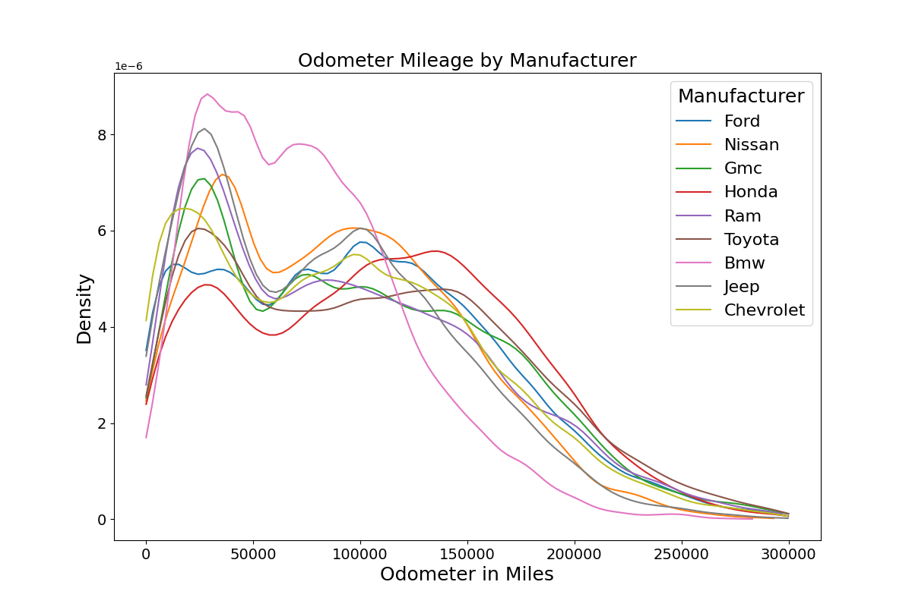
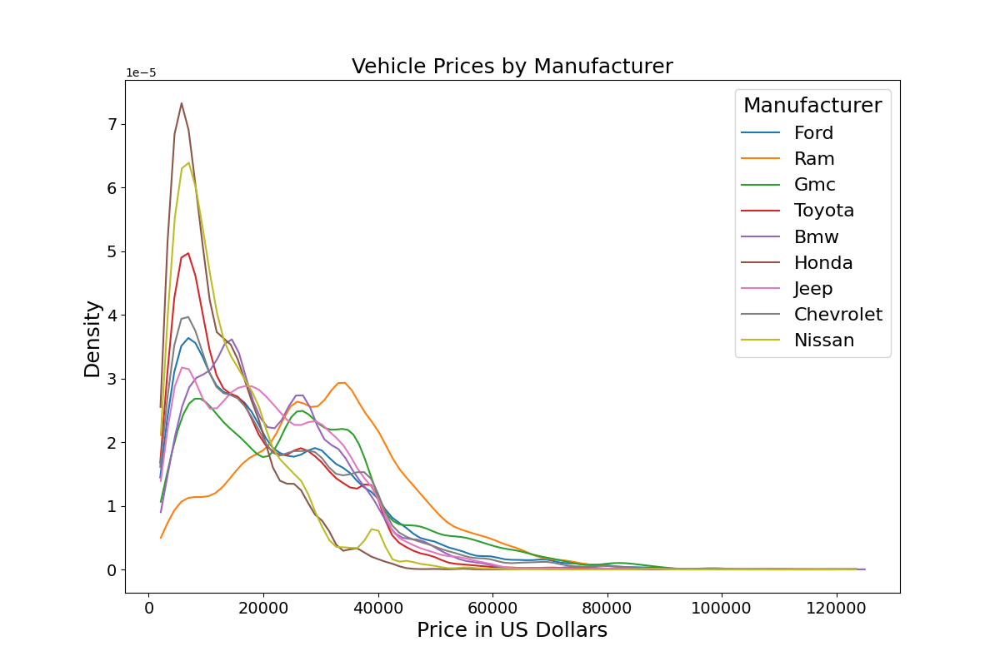
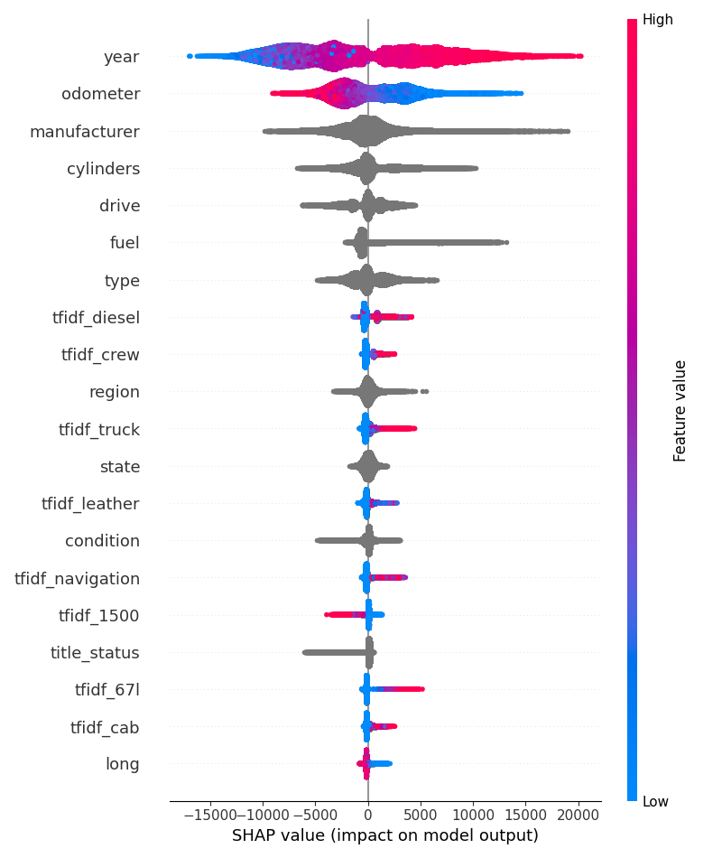

## Marketing Tracking of Craigslist's Used Cars

## Executive Summary

To predict car prices in Craigslist ads, I developed a LightGBM model, achieving an RMSE of \$5,400—indicating predictions were off by about \$5,000 on average—and explaining 85% of the variability in price. The most influential variables were year, odometer, manufacturer, and words linked to high trim levels like "leather" and "navigation." Another key variable was whether the vehicle was a truck. Future model improvements include refining Carvana ad interpretation and analyzing car images to detect damage. 

## Table of Contents
1. [Introduction](#introduction)
2. [Problem Definition](#problem-definition)
3. [Exploratory Data Analysis (EDA)](#exploratory-data-analysis-eda)
4. [Data Preprocessing and Feature Engineering](#data-preprocessing-and-feature-engineering)
    - [Handling Missing Values](#handling-missing-values)
    - [Filtering Data](#filtering-data)
    - [Feature Engineering](#feature-engineering)
5. [Modeling](#modeling)
   - [Model One: Simple Ordinary Least Squares Regression](#model-one-simple-ordinary-least-squares-regression)
   - [Model Two: Log (Price) Multiple Linear Regression](#model-two-log-price-multiple-linear-regression)
   - [Model Three: Light GBM](#model-three-light-gbm)
   - [Model Four: Light GBM with HyperOpt and Words](#model-four-light-gbm-with-hyperopt-and-words)
6. [Model Comparisons and Usage](#model-comparisons-and-usage)  
7. [Conclusion](#conclusion)
8. [Future Work](#future-work)
    - [Renovate Carvana Ad Descriptions](#renovate-carvana-ad-descriptions)
    - [Download Images and Build a CVML Model](#download-images-and-build-a-cvml-model)
    - [Cross Validation in Model Training and Hyperparameter Tuning](#cross-validation-in-model-training-and-hyperparameter-tuning)
    - [Add Unit and Integration Tests](#add-unit-and-integration-tests)
    - [Use Lat and Long to Find Additional Factors](#use-lat-and-long-to-find-additional-factors)
    - [Convert Cylinders to Numeric](#convert-cylinders-to-numeric)
9. [Resources Consulted](#resources-consulted)
10. [Technical Addendum](#technical-addendum)
    - [Linear Regression Model Summary](#linear-regression-model-summary)
    - [Hyperparameter Tuning](#hyperparameter-tuning)

## Introduction
**Growing up, I had a family friend who was always poring over Craigslist ads, buying cars, fixing them up, and flipping them for profit. I can still picture him, bathed in the dim glow of a cathode ray tube, surrounded by stacks of printed ads. Each purchase took him at least forty hours of searching. The young math enthusiast in me quickly identified that as the biggest bottle neck.**

This project is an ode to that family friend. It aims to build a tool for predicting Craigslist car prices—similar to tools from Kelley Blue Book or Ford Financing. With this tool, our anonymous hero could efficiently spot underpriced listings and secure them quickly. Taking it further, he could even create a synthetic dataset of representative vehicles, train the model over time, and use it to monitor price shifts month by month. With fixed synthetic test data, any price changes would directly reflect market trends, offering insights into shifting values across the used car market.

## Problem Definition

A generous contributor has scraped 463,000 car postings from Craigslist over a single weekend in early 2024 and shared them on [Kaggle](https://www.kaggle.com/datasets/austinreese/craigslist-carstrucks-data/code). I have downloaded the zipped CSV file, and this is where my analysis begins. This file is too big to easily fit on GitHub, so if you'd like to run these scripts, you'll need to download it and save it to inputs\vehicles.csv.zip. 

The target variable is the price, represented in US Dollars. The dataset includes eighteen useful covariates which I lay out in the data dictionary below. Subject knowledge suggests that the most important variables will be manufacturer, year, odometer and description. Note to the reader, I will use cars, automobiles and vehicles interchangeably throughout the text. 

#### Table 1: Data Dictionary
| Column Name     | Data Type | Description                                                      | % Missing/NA | % Zero |
|-----------------|-----------|------------------------------------------------------------------|-----------|------------|
| price           | Float     | Target variable representing the price in US Dollars             | 0%        | 0%        |
| region          | String    | The region or metro area where the vehicle is located            | 7.7%        | NA        |
| year            | Integer   | Year of manufacture of the vehicle                               | 0.3%        | 0%        | 
| manufacturer    | String    | The manufacturer (e.g., Ram, Jeep)                               | 4.1%        | NA        | 
| model           | String    | The vehicle's model (e.g., Silverado, Forester)                  | 1.2%        | NA        | 
| condition       | String    | Condition of the vehicle (e.g., good, fair)                      | 40.8%       | NA         |
| cylinders       | String   | Number of cylinders (e.g., 4 cylinders, 6 cylinders)              | 41.6%        | NA        |
| fuel            | String    | Type of fuel used (e.g., diesel, gas)                            | .7%        | NA         | 
| odometer        | Float     | Miles the vehicle has traveled                                   | 1%        | 5%        | 
| title_status    | String    | Status of the vehicle's title (e.g., rebuilt, clean)             | 1.9%        | NA         | 
| transmission    | String    | Type of transmission (e.g., automatic, manual)                   | 0.6%        | NA         | 
| drive           | String    | Drive type (e.g., FWD, RWD)                                      | 30.6%       | NA         | 
| type            | String    | Type of vehicle (e.g., sedan, truck)                             | 21.8%        | NA         | 
| paint_color     | String    | Exterior paint color (e.g., white, black)                        | 30.5%     |   NA         | 
| description     | String    | A description of the vehicle by the seller                        | 0.1%        | NA         |
| state           | String    | U.S. state where the vehicle is being sold                       | 0%        | NA      |
| lat             | Float     | Latitude of the vehicle’s location                               | 1.5%       | 0%       | 
| long            | Float     | Longitude of the vehicle’s location                              | 1.5%       | 0%       | 

## Exploratory Data Analysis (EDA)

For a thorough EDA using `y_data_profiling`, see the visualizations on a subsample of the data from [before processing](results_final/data_profile_cleaned_subsampled_to_one_percent.html) and [after processing](results_final/data_profile_raw_subsampled_to_one_percent.html). In the interest of space, I will mention the most pertinent details. Price and odometer are heavily right-skewed; some odometer's are equivalent to twenty round trips to the moon. It’s safe to say there are some data quality issues, which I will address in [data preprocessing](#data-preprocessing-and-feature-engineering). Another pertinent topic is the high frequency of Carvana ads at 15%; since they exhibit higher data quality and more consistency across ads, they form an interesting part of the puzzle. However, their descriptions are mostly identical boilerplate across many ads. 

    
    

***Figure 1***: *Notice the right skew of both fields and the spike of 0s in price. Not shown are 346, and 3032 observations greater then \$125,000 and 300,000 miles respectively*

Digging into correlations below, there are relationships between price, age, and odometer reading. Older vehicles typically have more miles and are worth less. But miles and age are highly collinear, it is rare to find high mileage young cars and vice versa. So untangling mileage from age is a complex problem that is be beyond the scope of this paper. I also notice correlations between [word frequency, i.e., TF_IDF](#feature-engineering) and odometer readings, suggesting that certain words are used more or less frequently depending on car mileage; this aligns with expectations. Words like reliable, typically, describe family vans not sport cars. In general, words seem negatively correlated with odometer. Which makes sense as more verbose ads are going to be associated with nicer, newer, more expensive vehicles. Finally, the manufacturer shows a correlation with the number of cylinders and transmission type, which again conforms to common sense.

***Figure 2***: *The Correlation gram for the raw and cleaned data respectively. Correlations here are Spearman for numeric columns and Cramer V correlations for any non-numeric correlations.* 

Additionally, about six percent of the rows appear to be exact duplicates of other rows. While they could represent truly different automobiles, the exact matching of price, location, odometer, color, etc., strains credulity, so I will drop these results. Likely people are reposting the same ad to make their ad appear new. A final correlation I wanted to examine was how price and mileage vary by manufacturer, an important variable. Interestingly, some manufacturers have distinct patterns. BMW seems to have more low mileage cars on the market. Perhaps  due to noticeably higher costs of maintenance, gas and insurance, people sell earlier. Ram's higher average price is baffling as it disagrees with [Motor Trend's reporting](https://www.motortrend.com/features/worst-resale-value-pickup-trucks/). Motor Trend has three of the top 10 worst reselling trucks as Ram trucks.

    
    

***Figure 3***:  *Notice how BMW and Ram, respectively, seem to buck the trend. Note only popular manufacturers shown here.* 

## Data Preprocessing and Feature Engineering

### Handling Missing Values
Ads with missing price or odometer readings were entirely removed, as these values are too crucial to have missing. Missing values were only imputed for linear regression, using a standard mean or mode method. I imputed these columns: year, manufacturer, state, title status, paint color. A brief examination of missing values is in order. All columns likely exhibit at least a degree of Missing Not at Random (MNAR). As the missingness of variables is related to price and could accidentally, intentionally, and perhaps maliciously missing, any analysis should be questioned with data accidentally, intentionally, and perhaps maliciously missing. 

### Filtering Data
Craigslist seems especially prone to messy data for two reasons: individual posters are not professionals with a corporate image to maintain, and obfuscating certain information can be advantageous. Good cars that are worth a lot are typically owned by more internet-savvy individuals, who understand that spending time to create a great ad to gain even a 2% increase in price. Conversely, the negative aspects of a car are often best left unmentioned and discussed later if inquiries arise; a classic example of adverse selection. 

The other key problem is [price anchoring](https://en.wikipedia.org/wiki/Anchoring_effect). The highest price a seller will get for their car is often determined by the first price they mention. It's much better to allow the buyer to propose a price and then ask for more. By not listing a price or by listing unrealistic values like \$9 million or \$1, sellers can avoid anchoring their price. With 6% of vehicles being listed for \$0, I believe this is price anchoring but could be other phenomena as well. 

With this in mind, I applied several filters to the dataset. I removed any cars priced under \$2,000, as these were either scrap/parts cars or examples of price anchoring, and excluded any cars priced over \$125,000. Most of the ads I found above \$125,000 appeared illegitimate. Additionally, I removed any automobiles with over 300,000 miles, as this is a reasonable upper limit for a car's lifespan; some sellers obfuscate mileage by listing an impossible mileage like 9,999,999 miles. Lastly, I removed all duplicate rows, which eliminated about six percent of the data; this is due to people reposting ads to appear new and garner more clicks. Finally, I set 5% of the data aside to be test data.

### Feature Engineering
This process primarily consisted of two parts, feature creation and then working with text descriptions. The first part involved standard feature engineering. I created flags to indicate whether the ad included a description and whether it was a Carvana ad. Additionally, I converted the condition from a categorical to an ordinal variable. Categories like "Excellent" and "Fair" have a clear order that should be retained. 

To clean the words up, I deleted any stop words which are common words: or, and, the. I also deleted words with less than three characters. A key problem in the text analysis was the Carvana Ads. With each ad having over a thousand words of identical boiler plate and tens of thousands of ads, Carvana washed out a lot otherwise useful words. To get around this, I labeled each specific ad as being a Carvana ad or not, and for rows that were Carvana ads, I deleted that specific row's description. 

The more interesting, second, piece of feature engineering involved analyzing the description text using [term frequency, inverse document frequency](https://builtin.com/articles/tf-idf). In essence, TF-IDF gives more weight to words that are rare across all descriptions (IDF) and emphasizes words that appear frequently within a specific description (TF). For example, in Disney movies, “dwarf” has a higher IDF score than “princess” because dwarves are unique to *Snow White* while princesses feature in many stories. In terms of TF, the term “food” would score high in *Ratatouille* since the story focuses on cooking, making the term far more frequent in that context compared to something like *Beauty and the Beast*. Put another way, TF_IDF scores words highly that are more unique among documents but yet common in the documents that have them. These scores are then combined together to give one score. 

Ultimately, this results in 500 columns, with each column representing a word like cab, leather or diesel. Each ad description (row) is then scored for each column creating a resulting data frame 500 columns wide and 400k+ rows long. I can then use these as variables in the modeling later on. 

#### Table 2: Data Cleaning Process

| Cleaning/Engineering Step               | Columns Affected               | Values Created / Modified      | Rows Changed / Deleted % (row count)|
|-----------------------------|---------------------------------|-------------------------------|------------------------|
| Drop unnecessary columns               | Deleted id, url, region_url, VIN, image_url, county, posting_date, size|         | all rows updated|
| Create boolean for description exists | create description_exists column           |  boolean          | all rows updated|      |
| Detect if Carvana ad                  | create Carvana_ad                          | boolean          | all rows updated| 15% (62,861)|
| Delete description if caravana        |  description                               | drop description if its Carvana ad  | 15% (62,861)|
| Switch condition to ordinal           | condition                                  | moved strings to ints to capture order| 59% (252,776)|
| Drop impossibly high prices           | any price above \$125k                     | row deleted       | 0% (346)|
| Drop impossibly low prices            | any price below \$2k                       | row deleted       | 12% (49,998 rows)|
| Drop impossible odometer              | mileage above 300k miles (i.e. 20 round trips to the moon)       | row deleted     | 0% (3032)|
| Deduplicate listings                  | all columns                                | Removed exact duplicates| 6% (24,229)|
| Remove stop words and words < 3 characters long| description                       |                   | all rows with a description|
| Create TF_IDF                         | create 500 columns                         |                   | all rows with description|
| Delete description                    |Description                                 |                   | all rows|

## Modeling

### Model One: Simple Ordinary Least Squares Regression
I iterated through four models in this project, progressively improving with each iteration. To assess model quality, I used RMSE and R² while also favoring simpler models with equivalent success. In the end, I used the 5% of data I set aside as test to score the final two models. My first model was the starting point for almost any good data science regression project: linear regression. My baseline is ordinary least squares regression with the odometer as my covariate.

The good news was that the model trains quickly and was the most interpretable of all models. I obtained a training RMSE of \$12,000 and an R² of 29%. This means the model was off by about \$12,000 on average. The odometer explains about 29% of the total variation in price. Interpreting the model, the average car's value starts at \$31,140, and for each 1,000 miles driven, the price decreases by \$127. For more details, I have the model summary in the [technical addendum.](#technical-addendum)

In the interest of brevity, I won't delve too deeply into checking the assumptions, as they all failed: linearity, homoscedasticity, and normality. I have plotted the residuals in the section below, Figure 4. While many types of inference are robust, this is too much for even the most robust linear regression methods. Another issue is the negative predictions; after 250,000 miles, the model starts predicting negative prices. Left with an untrustworthy and inaccurate model, it's time to go back to the drawing board. 

### Model Two: Log (Price) Multiple Linear Regression

In my next model, I aimed to reduce model bias. I started by logging the price. The intuition behind this approach is that price spans several magnitudes, and the model will no longer predict negative values. Additionally, any missing values were replaced using mean/mode imputation. This involves replacing the missing value with whatever the most "average" value was for the column. 

The second strategy for addressing an underfitted model involved introducing additional terms: year, manufacturer, state, title status, and paint color. I selected these variables because they exhibit low cardinality, align with lived experience and common sense, and have low rates of missing values. Variables with a significant number of missing values would require extensive mean/mode imputation, which could diminish their value. Additionally, variables with many possible responses risk spreading data too thinly.

Reviewing the results below, the negative predictions have disappeared and the model now explains 40% of the variability in price. Furthermore, RMSE has dropped by about \$1,000. While accuracy has improved, the model grew from two parameters to 80. This model also fails all the assumptions of linear regression.

    
    

***Figure 4***: *Residuals of the simple least squares regression and log price regression respectively. Note how many predictions in the residuals are actually negative in the simple least squares regression.*  

### Model Three: Light GBM
Linear regression isn’t going to cut it on this dataset, so I'll try another tool: LightGBM. Light GBM is a boosting methodology that builds a series of decision trees, each adjusting for the errors of its predecessors. Light GBM offers a few features that sets it above other boosting methods like XGBoost. These features include better bundling of sparse columns and sampling better focused on the worst predictions. Let's begin with a naïve LightGBM approach, using all of the usable variables without using any feature-engineered variables.

The great news is that this method provided a dramatic improvement in the model's performance. The RMSE dropped down to \$6,200, and the model can explain about 82% of the variation in price. This is a material improvement in accuracy, but it did cost a bit in terms of speed and explainability. Specifically, the time to fit the model increased from about 10 seconds for the previous model to around four minutes for this one. 

Addressing interpretability is a bit more challenging, but I will use [SHAP](https://shap.readthedocs.io/en/latest/index.html) to better understand how specific variables affect the predictions. SHAP, is a powerful tool that uses Shapley values to estimate each variables contribution to the prediction. It uses a cooperative game theory concept where each variable is awarded the difference in scores between if it had and hadn't been involved. For example, if the variable paint color is included and the price is \$11k and the variable paint color is not included and the price drops to \$10k, then for this observation, the SHAP value is 1k. 

SHAP is powerful because the contributions are clear and can be added together and separated. For example, the impact of the car being in California vs. the impact of the car being a sedan can be directly weighed and compared.

Visualizing these results is best so I'll depict the SHAP summary plot below. It can seem daunting at first so I'll break down the first row. The first row, "year," the farther right you go, the higher the SHAP value (X axis), which increases the predicted price. Most of the rightmost values are red, indicating high feature values (Color Axis), which aligns with common sense: newer manufacturing years are likely to sell for more.

Odometer has a similar but opposite story for obvious reasons, more mileage, cheaper car. Interestingly, longitude, at the lowest values (light blue), is associated with positive increases in price (high SHAP values). This could be explained by the fact that the west coast and Hawaii—locations with lower longitude—are high-cost-of-living areas. An alternate explanation might be warmer climates out west use less salt in winter and therefore less rust.

Categorical variables are a bit harder to use in SHAP summary plots as they lack the clear sense of bigger to smaller and the resulting colorings. However, some categorical variables do tell a story. The far-right skew in the region seems to suggest region usually doesn't tell affect price much, but it has occasionally driven price up substantially. I haven't figured out how to pinpoint what values these are yet but I suspect they correspond to high-cost locations. Similarly, title status mostly has no effect on value, but certain titles can severely decrease the price. This aligns with prior EDA, where most titles were clean, while some were salvage, parts, or lien. These titles mean the car is in terrible shape or the car is involved in a loan. All of which can steeply drive down a sale price.

    
    

***Figure 5***: *The SHAP Summary and RMSE over training for model three.*

### 4. Model Four: Light GBM with HyperOpt and Words
From here, a variety of options awaits: hyperparameter tuning, adding text data from the description, utilizing latitude and longitude to pull in zip code data, implementing cross-validation, and exploring the time and date of posting. I implemented the first two ideas but moved the others to future work. 

The first step was addressing overfitting in early trials not shown here. While doing so, I set up HyperOpt. HyperOpt is one of my favorite tools for hyperparameter optimization. It uses a Bayesian framework to search more efficiently by using prior runs to inform future ones. An analogy: you are looking for a plane that flew between New York and London and crashed in the ocean. If you find debris, you should concentrate all your searchers in that spot to thoroughly comb the area. For more on hyperparameters and how I tuned them, see the [addendum](#hyperparameter-tuning) below.

Getting to the results, interpreting TF_IDF is nice in this chart. The solid light blue bands at 0 represent TF_IDF score of 0 and ads without descriptions, i.e., the word never appeared in that description or there wasn't a description. So looking at things like tfidf_crew, cab, truck and diesel, the presence of a word (red dots) increased the value! This generally conforms to expectations that trucks are more expensive and hold resale value longer. Perhaps, creating a boolean variable for truck could also help. Similarly, luxury amenities like leather and navigation are associated with higher prices overall. 

Finally, two unclear cases stand out that required some investigating: tfidf_67l and tfidf_1500. Once again, trucks are the answer. 1500 traditionally denotes a light duty pick up capable of carrying half a ton. Truck brands such as Chevrolet and Ram still describe their low end, cheaper trucks as 1500's. Which is why some ads have high values of 1500, ie, the word 1500 is in the description a lot, with lower SHAP values as they are lower end, cheaper trucks. 6.7L refers to a very large diesel engine on the largest of large vehicles which explains its positive correlation with expensive vehicles.   

    
    

***Figure 6***: *SHAP summary for trucks and RMSE over training. A bit more overfitting here and words related to trucks show up a lot in the SHAP analysis.*

#### Table 3: The four modeling approaches

| Model                             | Explanatory Variables            | Hyper Parameters                           | RMSE       | R²        | Training Time        |
|-----------------------------------|--------------------|-------------------|------------|-----------|-----------|
| Ordinary Least Squares            | odometer       | `None`                                 | $12,202    | 29.1%    |less than a second|
| Log(Price) Least Squares                 | year, manufacturer, odometer, paint_color, state, title_status| `None`                                 | $11,077     | 51.9%    |5 seconds|
| LightGBM                          | all standard variables      |'learning_rate': 0.1, 'max_depth': 6, 'lambda_l1': 0,  'lambda_l2': 0, 'num_leaves': 41` | $6200    | 81.4%   | 4 minutes|
| LightGBM with HyperOpt and Text  | all standard variables, has_description?, is_carvana_ad?, 500 words (TF_IDF)|  'learning_rate': 0.05, 'max_depth': 8, 'number_of_leaves':166, 'min_data_in_leaf': 5000 | $5,412 | 85.8%    | 2.5 hours|

*Note the last two models were tested on 5% hold out test data, while the first two were tested on the training data.* 

## Model Comparisons and Usage
Comparing the models, linear regression offers interpretability and statistical inference. However, given that none of the underlying assumptions hold, it's not trustworthy. Therefore, LightGBM emerges as a more suitable model for this use case.

The next question is whether to use the model with TF_IDF and feature engineering or the base model. The more complex model (Model 4) takes about 45 times longer to train and tune. However, even if the model was trained nightly, this isn't a substantial problem. Prediction speed is more important, as users will want to generate predictions daily, if not hourly, to capitalize on deals promptly. The prediction speed is very fast at less than a second for 20k rows. Finally, I used my 5% hold out test data to get final test RMSE and R² for both lightGBM models.  

## Conclusion
In conclusion, I determined that a feature-engineered model using LightGBM, which incorporates text data, is the best approach. The model achieved an RMSE of \$5,412 and was able to explain approximately 85% of the variance in price. This is not accurate enough to algorithmically trade used cars as the [Zillow's fall](https://www.wired.com/story/zillow-ibuyer-real-estate/) shows. However, this should be accurate enough to at least clue the user into good deals. In the model, the most significant variables influencing price were year, odometer reading, manufacturer, cylinders, and drive. Looking at the most important keywords, they were diesel, crew, truck, leather and navigation. This conforms to expectation as these are associated with trucks, a more expensive, slower depreciating asset. Additionally, high end car upgrades like leather seats and custom navigation systems are also associated with high prices. 

However, this approach has limitations. It is restricted to the data timeframe (early 2024), and I excluded about 18% of the total rows due to implausible data and/or duplicate ads. These corrupt data points and missing values are not missing at random and their absence affects the model and its estimates. While Carvana is a relatively minor player in the overall market, it is the largest within the fragmented Craigslist marketplace. Their pricing strategies could significantly influence market dynamics, and more attention should be directed toward their pricing practices.

To tie up the story, I will depict how our anonymous hero is using Model 4. I envision him using SHAP to create a waterfall plot that illustrates how the LightGBM model adjusts prices. This approach allows the user to leverage subject matter expertise to validate, adjust, or disregard each prediction. Here’s an example, row 140 in the test set, using the final model. It's a newish Chevy Sedan. Being a 2019 car, this drives the price up \$11,700. The mention of leather drives the price up another \$1k, while navigation drives the prices up another \$2.2k. However, being a Chevrolet and being a sedan, both drive the price down \$2k each. You can imagine our hero sitting in the cathode ray tube haze and saying "well actually, this is a really deluxe custom navigation system so maybe increase the price a bit more. And while Drive in NAN in the data set, I actually know it's always FWD. So, let's re-run this SHAP analysis with Drive = FWD." A melding of subject matter expertise and quantitative knowhow!

    

***Figure 7***: *SHAP waterfall plot giving the anonymous hero, the model prediction and more importantly why!*

## Future Work
### Renovate Carvana Ad Descriptions
Pull out useful info from Craigslist Carvana ads and delete the boiler plate. Today, there is too much static data in the descriptions that overwhelms TF_IDF, so I turn Carvana ads into a boolean variable. A further analysis could just delete the boiler plate and extract the nuggets of information.

### Download Images and build a CVML model
The dataset currently includes only image URLs. Although downloading all images and utilizing them is beyond the current project's scope, there is significant potential for future exploration. By implementing a computer vision machine learning (CVML) model, I could analyze these images to assess car quality, specifically looking for indicators such as rust, dents, and scratches. While I have experience in this area, I must keep the secret sauce secret.

### Cross validation in model training and hyper parameter tuning.
Cross validation would be great and would help with over fitting and model accuracy. Unfortunately, that involves more computation and this project is already getting slow on my PC. With a high-powered PC or the ability to spin up AWS clusters, the reader could definitely pursue that angle. 

### Add unit and integration tests
This is all internal with no data changes outside when the CSV changes. So integration tests should be easy to do as nothings changing. I would probably use pytest for this and would set up Github actions to require all tests passing before merging and accepting into main. 

### Use lat and long to find additional factors
Pull in lat and long and do a reverse look up to find nearest zip code. SQL, Google API's and Python all have tools for this. From here, I can use Census data to pull in information about the place the car is sold. It could look at things like Urban vs. Rural and Population Density as bigger cities have higher cost of living (COL). I could also explore using a state or metro area COL based on something like NerdWallet's rankings.

### Convert cylinders to numeric
I converted the number of cylinders from a string to a numeric type to preserve that ordinal information but this created a column of mixed types that the script would infrequently fail on; so, this code has been removed and [an issue](https://github.com/AnAbominableSnowman/predict_craiglist_car_prices/issues/17) created to one day replace it.

## Resources Consulted
https://gabrieltseng.github.io/posts/2018-02-25-XGB/
https://www.kaggle.com/code/bextuychiev/lgbm-optuna-hyperparameter-tuning-w-understanding
https://www.geeksforgeeks.org/lightgbm-regularization-parameters/
https://www.geeksforgeeks.org/understanding-tf-idf-term-frequency-inverse-document-frequency/
https://en.wikipedia.org/wiki/Tf%E2%80%93idf
https://lightgbm.readthedocs.io/en/stable/
https://docs.pola.rs/

## Technical Addendum

### Linear Regression Model Summary

    
    

Here the OLS is on the left and Log Price MLS on the right. Not all 80 terms are shown for Log Price MLS for the sake of space and time. The whole summary can be found [here](results_final/Log%20price%20Linear%20Regression/ols_summary.txt).

### Hyperparameter Tuning
Before talking about hyperparameter optimization, I should explain what hyperparameters are. I like to think of them as meta-settings set outside and before the process that can be learned over many fittings of the model. The analogy I use is what if we were about to play a game of soccer but first, we tweaked how long the grass on the field was, is it raining, and is the field slanted towards or away from the net. Each soccer games would be soccer but tweaking any of these meta (i.e. hyper) parameters would dramatically change the game. After a while, you'd find the best and fairest games are played on level fields, without much rain on a clear beautiful day. 

Back to the tuning, I focused on optimizing a few hyperparameters: learning rate, maximum depth, the number of TF-IDF words, and L1 and L2 regularization. I did not tune the number of leaves, as I fixed that to be 65% of 2^max_depth. [Why?](https://lightgbm.readthedocs.io/en/latest/Parameters-Tuning.html) Because LightGBM grows leaf-first rather than level-first, fitting the maximum depth and setting the number of leaves to match it essentially mimics a level-first methodology similar to that of Random Forest. This approach is acceptable if overfitting is not an issue; however, since I am facing overfitting, I opted for a different strategy.

After several rounds of HyperOpt, each run pointed to the max number of TF_IDF words being optimal. I removed as a hyperparameter and always set it to use all TF_IDF columns. Additionally, I wanted to tackle overfitting with L1 and L2 regularization. I chose to use both at the same time as I was inspired by ElasticNet. L1 can be thought as promoting sparsity in the features and feature importance. While L2 can be thought of as pushing the weights in the model closer to 0. L1 is less important here as I have already done feature selection. Learning rate can be thought of as how quickly the model learns the data. Too slow and compute is wasted, too fast and the model rushs to conclusions and overfitting in the process. 